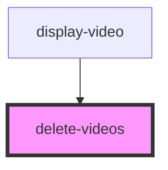

# video-and-note

<!-- Auto Generated Below -->

## Properties

| Property | Attribute | Description | Type     | Default     |
| -------- | --------- | ----------- | -------- | ----------- |
| `name`   | `name`    |             | `string` | `"Video"`   |
| `open`   | `open`    |             | `any`    | `undefined` |

## Dependencies

### Used by

 - [display-video](../displayVideos)

### Graph

----------------------------------------------

*Built with [StencilJS](https://stenciljs.com/)*
