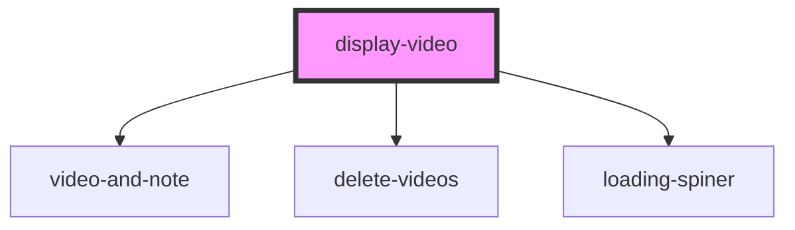

# display-video

<!-- Auto Generated Below -->

## Properties

| Property  | Attribute | Description | Type     | Default               |
| --------- | --------- | ----------- | -------- | --------------------- |
| `heading` | `heading` |             | `string` | `"This is a heading"` |
| `id`      | `id`      |             | `string` | `undefined`           |

## Dependencies

### Depends on

- [video-and-note](../videoAndNotesUpload)
- [delete-videos](../delete-videos)
- [loading-spiner](../loading-spiner)

### Graph

----------------------------------------------

*Built with [StencilJS](https://stenciljs.com/)*
