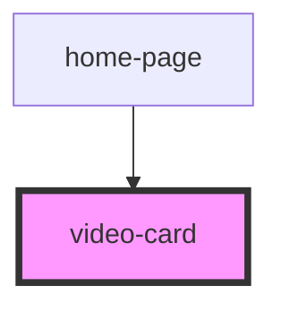

# video-card

<!-- Auto Generated Below -->

## Properties

| Property      | Attribute     | Description | Type      | Default                                 |
| ------------- | ------------- | ----------- | --------- | --------------------------------------- |
| `description` | `description` |             | `string`  | `"the quick brown fox jumps very high"` |
| `heading`     | `heading`     |             | `string`  | `"this a headings"`                     |
| `isloading`   | `isloading`   |             | `boolean` | `false`                                 |
| `prince`      | `prince`      |             | `number`  | `500`                                   |
| `src`         | `src`         |             | `string`  | `undefined`                             |
| `sub_heading` | `sub_heading` |             | `string`  | `undefined`                             |

## Dependencies

### Used by

 - [home-page](../homePage)

### Graph

----------------------------------------------

*Built with [StencilJS](https://stenciljs.com/)*
